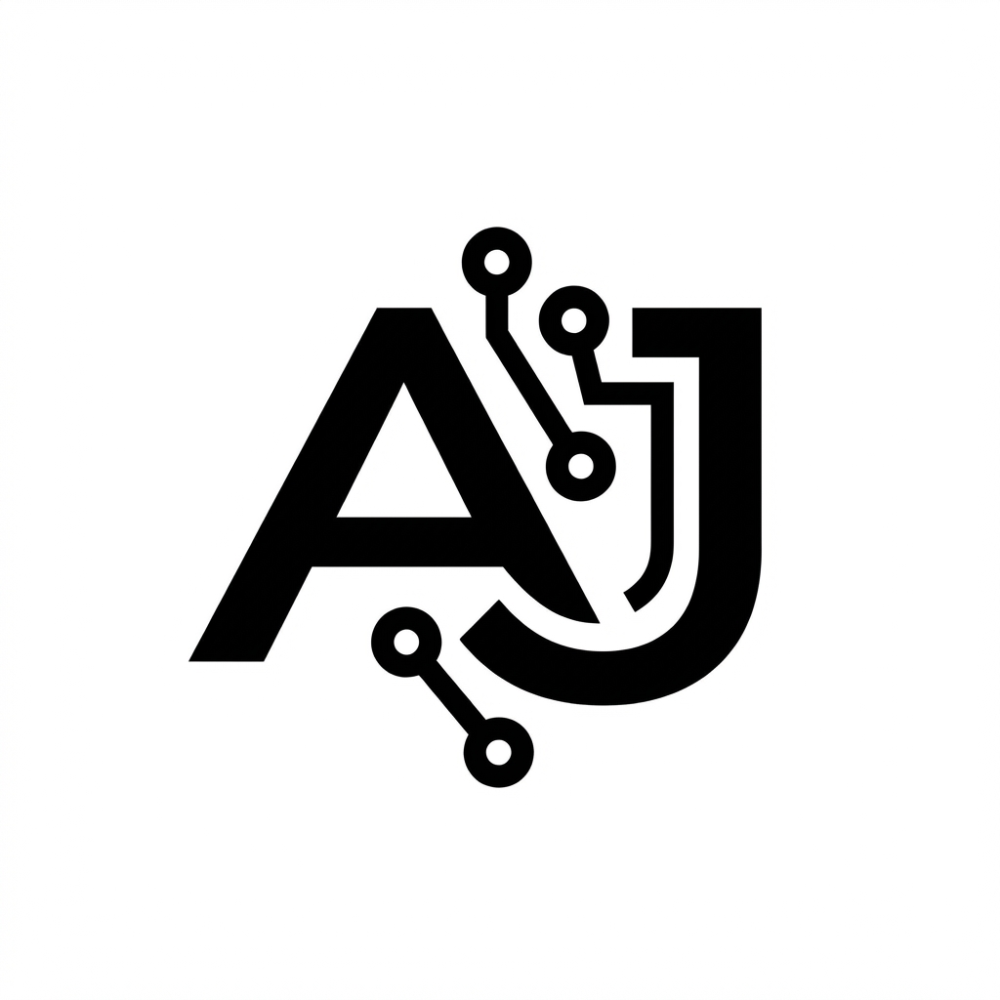

# AJ Systems - Tiffin Management SaaS

**Reliable daily tracking. Built right.**

AJ Systems is a production-ready SaaS application designed for Tiffin Service providers to manage their daily operations, customers, and monthly billing with ease.



## Features

-   **Dashboard**: Monthly summaries, daily progress, and active customer counts.
-   **Tiffin Management**: One-click "Give" and "Undo" for tiffins (Lunch/Dinner).
-   **Customer Management**: Add, edit, and deactivate customers.
-   **History & Billing**: View detailed monthly calendars and automated bill calculations.
-   **Mobile-First Design**: Fully responsive PWA (Progressive Web App) that works on any device.
-   **Secure**: JWT Authentication and secure Password Reset flow.

## Tech Stack

-   **Frontend**: React, TypeScript, Vite, Tailwind CSS
-   **Backend**: Python, FastAPI, SQLAlchemy
-   **Database**: PostgreSQL (Supabase)
-   **Deployment**: Render (Backend) + Vercel (Frontend)

## Local Development

### Prerequisites

-   Node.js & npm
-   Python 3.11+
-   PostgreSQL

### Setup

1.  **Clone the repository**
    ```bash
    git clone https://github.com/your-username/aj-systems.git
    cd aj-systems
    ```

2.  **Backend Setup**
    ```bash
    cd backend
    python -m venv .venv
    .\.venv\Scripts\activate
    pip install -r requirements.txt
    uvicorn app.main:app --reload
    ```

3.  **Frontend Setup**
    ```bash
    cd frontend
    npm install
    npm run dev
    ```

## Deployment

### Backend (Render)
-   **Build Command**: `pip install -r requirements.txt`
-   **Start Command**: `gunicorn app.main:app --workers 4 --worker-class uvicorn.workers.UvicornWorker --bind 0.0.0.0:10000`

### Frontend (Vercel)
-   **Framework**: Vite
-   **Output Directory**: `dist`
-   **Env Var**: `VITE_API_URL` pointing to the Render backend.

## License

© 2026 AJ Systems. Built by Arihant Jain.
